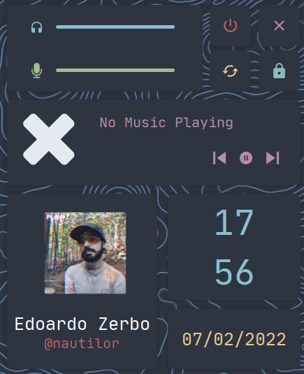

# EWW Theme
This is my custom implementation for a Nord EWW theme

# Requirements

- Font: **JetBrains Nerd Font Mono**

The script `bar` used to show some information required:
    - amixer
    - amixer-pulse-plugin
    - mpc

The script `spotiart` used to show the mopidy spotify album art requires:
    - mpd
    - mopidyartfetch
    - Pillow

# Preview
