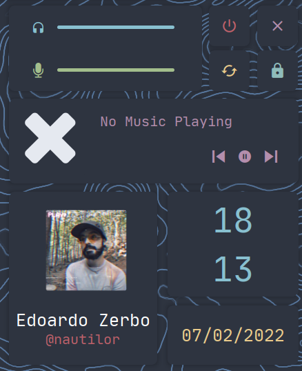

# EWW Theme
This is my custom implementation for a Nord EWW theme

# Requirements

- Font: **JetBrains Nerd Font Mono**

The script `bar.sh` used to show some information required:
- amixer
- amixer-pulse-plugin
- mpc

The script `spotiart.py` used to show the mopidy spotify album art requires:
- mpd
- mopidyartfetch
- Pillow

# Usage

use `launch_eww.sh` from the script folder to toggle it on and off

# Preview

